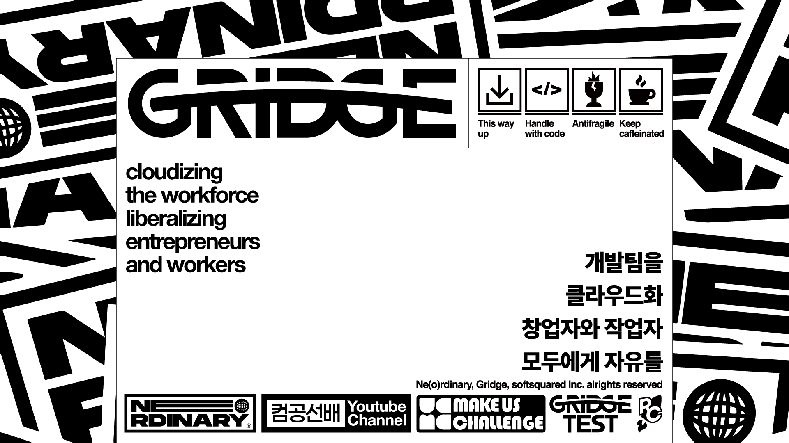

<div align="center">
<h1 align="center">NE(O)RDINARY TEMPLATE</h1>

<p align="center">
  <a href="https://gridge.co.kr/" rel="noopener" target="_blank">
    
  </a>
</p>


<p align="center">
  React.js + TypeScript + Redux
  <br>
  <a href="https://worker.gridge.co.kr"><strong>너디너리에 참여하러가기 👈</strong></a>
  <br>
  <br>
  <a href="https://github.com/neordinary/neordinary-template-react-ts-web/issues/new">버그 리포팅</a>
  ·
  <a href="https://github.com/neordinary/neordinary-template-react-ts-web/issues/new">기능 추가 요청</a>
  ·
  <a href="https://neordinary.github.io/">너디너리 블로그</a>
</p>

</div>

## 바로가기

- [권장버전](#권장버전)
- [설치방법](#설치방법)
- [실행방법](#실행방법)
- [빌드방법](#빌드방법)
- [프로젝트 구조에 대해 설명해주세요.](#프로젝트 구조에 대해 설명해주세요.)
- [새로운 화면은 어떻게 만들면 되나요?](#새로운 화면은 어떻게 만들면 되나요?)
- [API 연동은 어떻게 하면 될까요?](#API 연동은 어떻게 하면 될까요?)
- [3rd party API 연동은 어떻게 하면 될까요?](#3rd party API 연동은 어떻게 하면 될까요?)
- [질문 사항이 생기면 어떻게 해야하나요?](#질문 사항이 생기면 어떻게 해야하나요?)

## Quick start

## 권장버전

```sh
npm -v
# 8.19.2

node -v
# v18.12.1
```

## 설치방법

```sh
yarn global add eslint prettier
# lint 와 prettier 가 작동 할 수 있도록 global 로 설치해주세요.

yarn install
# @toast-ui/react-editor 라이브러리에서 react 18 버전을 지원하지 않아서 npm install 로 설치하면 에러가 발생합니다.
# 프로젝트 상황에 맞게 toast-ui 를 사용하지 않는다면 package.json 에서 해당 라이브러리를 지우고 npm install 로 설치해주세요.
```

## 실행방법

```sh
yarn start-local # 로컬에서 실행

yarn start-dev # dev 에서 실행

yarn start-prod # prod 에서 실행 
```

## 빌드방법

```sh
yarn build-dev # dev 환경용 build 파일 생성

yarn build-prod # prod 환경용 build 파일 생성
```

## 프로젝트 구조에 대해 설명해주세요.

```text
> .husky                    # git hook 을 실행시켜주는 폴더 (수정X)
> public
    > favicon.ico           # 브라우저 탭에 나오는 아이콘 파일
    > index.html            # React 소스를 랜더링하기 위한 Root DOM
    > manifest.json         # index.html 에 쓰일 값들 정의
> src
    > apis
        > core
            > index.ts      # axios 사용시 request, response 설정 파일
    > handlers              
            > ...           # api 핸들러 함수 폴더
        > types
            > ...           # api DTO 인터페이스 폴더
    > assets                # png, svg 등 이미지 에셋 폴더  
        > ...
    > components            # 반복적으로 쓰이는 컴포넌트 폴더
        > ...
    > config                # 프로젝트 내에 사용되는 설정 파일 폴더
        > _nav.ts           # 사이드 navation 바 항목
        > constant.ts       # 상수 파일
        > firebase.ts       # 파이어베이스 설정 파일
        > routes.ts         # 라우트 설정 파일
    > hooks                 # 커스텀 훅 폴더
        > ...
    > layout
        ...                 # 반복적으로 쓰이는 레이아웃 폴더
    > pages                 # 화면별 폴더
        > ...
    > scss                # CSS 파일들
        > ...
    > utils                 # 공통적으로 쓰이는 함수 모음 유틸 폴더
        > ...
    index.tsx               # 프로젝트 Root 파일
    QueryClientProvider.tsx # 리액트 쿼리 설정 파일
    store.ts                # Redux 파일
.browserslistrc             # 브라우저 호환성을 위한 browserslist 설정 파일
.editorconfig               # 편집툴 공통 설정 파일
.env.development            # development 환경에서 사용 할 환경변수 정의 파일
.env.development.local      # local ""
.env.production             # production ""
.eslintignore
.eslintrc.js                # 코드 퀄리티를 통일하기 위한 lint 설정 파일
.gitattributes
.gitignore
.prettierignore
.prettierrc.js              # 코드 컨벤션을 통일하기 위한 prettier 설정 파일
package.json                # node 모듈을 설치하고 실행, 빌드하는 명령어와 설정 모음 파일
README.md
svg.d.ts                    # svg 파일을 ts 에서 불러올 수 있도록 하는 설정 파일
tsconfig.json               # typescript 를 javascript 로 변환하는 설정 파일
```

## 새로운 화면은 어떻게 만들면 되나요?
1. src/pages 내에 화면별 폴더를 만들어주세요.
2. 폴더내에 index.tsx 와 styles.tsx 를 만들어주세요.
3. styles.tsx 에는 styled-components 컴포넌트들을 정의해주세요.
4. index.tsx 에서 styles.tsx 컴포넌트를 불러와서 랜더링해주세요.

## API 연동은 어떻게 하면 될까요?

1. API 호출시 사용되는 Response 또는 Request 인터페이스 작성
- (스웨거 스키마 참고)
```ts
export interface GetUserRequest {
  userId : number;
  phoneNum: string;
  nickName: string;
  email: string;
}
```

2. `src/apis/handlers/리소스별파일.ts` 파일 작성
```ts
getUser: async (payload: Partial<GetUserRequest> & TableRequest) => {
  const baseUrl = `/users`;
  const url = setApiParams(baseUrl, payload);
  return await request.get<TableResponse<GetUserDTO>>(url);
},
```

3. [리액트 쿼리](https://kyounghwan01.github.io/blog/React/react-query/basic/#usequery)


## 3rd party API 연동은 어떻게 하면 될까요?
새로운 npm 라이브러리를 사용해야 한다면 라이센스를 체크해야해요.

라이브러리마다 상업적으로 사용 가능/불가능한 라이센스를 가지고있기 때문에 꼭 확인해야해요.

## 좌측 네비게이션에 화면을 추가하려면 어떻게 해야하나요?
1. src/config/_nav.tsx 에 navGroup 혹은 navItem 을 추가해줍니다.
2. src/config/routes.ts 에 새로 만든 화면을 넣어줍니다.

## 질문 사항이 생기면 어떻게 해야하나요?
<a href="https://github.com/neordinary/neordinary-template-react-ts-web/issues/new">템플릿에 대한 질문 혹은 개선 사항 제안</a> 을 사용하여 이슈를 만들어주세요.

이슈를 확인하고 개선 사항을 반영하거나, 개선안으로 올려주신 PR이 있다면 검토후 적용하도록 하겠습니다. 
